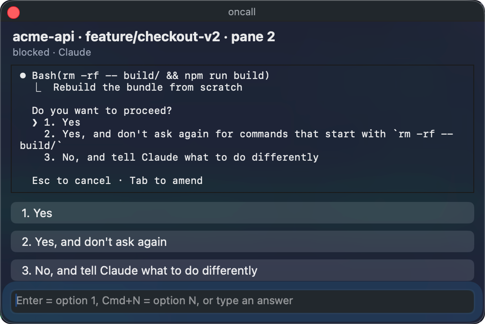

# Oncall

**Your coding agent hit a permission prompt. You're in another app, on another desktop, or out for coffee. Oncall gets you back in the loop — and lets you answer without going back.**

A [Herdr](https://herdr.dev) plugin that watches your agent panes and, the moment one blocks on a prompt or finishes a turn, puts the decision in front of you: a floating panel on your Mac with one button per option, or a Telegram message when you're away from the desk. Either way, your answer goes straight back into the pane.



Works with [Claude Code](https://claude.ai/code), OpenAI Codex, and any agent whose prompts Herdr can see.

## Why

Agents are fast right up until they need a yes. Then they sit there. If you've got four panes running, the cost isn't the decision — it's noticing, finding the right pane, and rebuilding the context you'd already dropped.

Oncall closes that gap:

- **It tells you which task, not just that something happened.** Every notification leads with `repo · branch · pane` — `acme-api · feature/checkout-v2 · pane 2`, not "an agent needs attention".
- **You answer from where you already are.** The panel floats above whatever you're doing and follows you across Spaces. Click a button, hit Enter for option 1, Cmd+N for option N, or type a free-text answer.
- **It reaches your phone when the desk doesn't work.** No answer within `BLOCKED_DELAY_SEC` (60s default) and Telegram takes over, with the same buttons.
- **It shuts up when it should.** Nothing pops up while you're already looking at that pane. The panel closes itself the moment you answer in the terminal, or when you switch to the pane yourself.

## How it decides to bother you

The interesting part isn't the notification — it's not sending one.

**It reads the screen, not the status flag.** Herdr marks a pane `blocked` by matching dialog wording anywhere in the recent buffer, so an agent that merely *prints* a permission prompt pins its own pane at blocked (this repo did exactly that to itself while the parser was being written). `pane get` can also hand back a stale value. So Oncall reads the pane and requires a *live* dialog — one with nothing but key hints and status footers below it. Quoted text always has real content underneath.

**It reads the pane, not your display.** Pane reads go through Herdr's socket to the server that owns the PTY. The terminal can be minimised, on another Space, or in a workspace you can't see.

**It parses the dialog structurally.** Options come from the numbered run at the *bottom* of the screen, never the first one found — a workflow's phase list is not a set of choices. Block boundaries come from the UI's own structure (turn markers, drawn rules, paragraph breaks), never from a "last N lines" guess.

**It never sends the transcript.** Blocked sends the tool call and the dialog. Done sends the last assistant turn. That's it.

**Only your chat can drive your panes.** Messages from any chat other than your paired `TELEGRAM_CHAT_ID` are dropped, on both the message and the button-callback path.

## Install

```sh
herdr plugin install fulanto/herdr-oncall --yes
```

That compiles the desktop panel and starts the Telegram poller — no Herdr restart needed.

The panel works on its own. For Telegram, add a bot token and pair your chat:

```sh
herdr plugin config-dir com.codreamer.herdr.oncall
```

Put `TELEGRAM_BOT_TOKEN=…` (from [@BotFather](https://t.me/BotFather)) in the `.env` there and leave `TELEGRAM_CHAT_ID` empty, then:

```sh
herdr plugin action invoke poll --plugin com.codreamer.herdr.oncall
herdr plugin action invoke pair --plugin com.codreamer.herdr.oncall
```

Scan the terminal QR or open the printed `t.me/…?start=…` link. The poller writes `TELEGRAM_CHAT_ID` for you. Send a test ping:

```sh
herdr plugin action invoke test --plugin com.codreamer.herdr.oncall
herdr plugin log list --plugin com.codreamer.herdr.oncall --limit 5
```

Reply to it in Telegram — you should get `sent · …` back.

`plugin action invoke` returns JSON immediately; the real output is in `plugin log list`.

### Requirements

- **Herdr** ≥ 0.7.0 and **Node.js** ≥ 18. No npm dependencies — `node:` builtins and `fetch` only.
- **The desktop panel is macOS-only** and needs Xcode Command Line Tools (`xcode-select --install`). Install compiles `src/desktop/panel.swift` once; without `swiftc` the panel is skipped and Telegram still works.
- Pairing QR codes use `qrencode`, installed automatically via Homebrew on macOS or your system package manager on Linux (needs root or passwordless `sudo` there).
- If the plugin log says `node not found`, start Herdr from a terminal where `command -v node` works.

Your `.env` survives reinstalls.

## Config

| key | default | meaning |
|---|---|---|
| `NOTIFY_ON` | `blocked,done` | which statuses to notify on |
| `BLOCKED_DELAY_SEC` | `60` | how long the panel waits before Telegram takes over. `0` = ping immediately |
| `DEBOUNCE_MS` | `2000` | suppress a repeat of the same pane + status |
| `TELEGRAM_BOT_TOKEN` | required for Telegram | BotFather token |
| `TELEGRAM_CHAT_ID` | set by pairing | the only chat allowed to drive your panes |
| `TELEGRAM_POLL` | `1` | long-poll for replies |
| `TELEGRAM_FORCE_REPLY` | `1` | force a reply box on pings |
| `DESKTOP_PANEL` | `1` | the macOS panel; `0` = Telegram only |
| `DESKTOP_PANEL_TIMEOUT_SEC` | `BLOCKED_DELAY_SEC` | how long the panel stays open |
| `DESKTOP_PANEL_TERMINALS` | empty | extra terminal bundle ids that count as "you're at the pane" |
| `DESKTOP_PANEL_DEBUG` | empty | `1` logs the screen and window rect the panel was placed on |
| `HERDR_TELEGRAM_ENABLED` | `1` | start enabled; toggle with the `toggle` action |
| `HERDR_TELEGRAM_SET_TITLE` | `1` | set the host terminal title while on |
| `CHANNEL` | `telegram` | delivery path |

Toggle it off without uninstalling:

```sh
herdr plugin action invoke toggle --plugin com.codreamer.herdr.oncall
```

## What it will not do

- Send the full pane transcript. Blocked gets the dialog, done gets the last turn.
- Ship a phone app. Telegram is the remote channel; a thin app would talk to this same plugin.
- Show a system notification banner with buttons — macOS only allows that for a signed app bundle, so the panel is a plain floating window instead.

## Development

```sh
node --test 'test/*.test.mjs'        # 46 tests, node's built-in runner
bash install.sh                      # link this checkout into Herdr
bash bin/install-deps.sh             # rebuild the panel after editing panel.swift
```

```text
herdr-plugin.toml     manifest: actions, event hooks, build steps
bin/                  node locator, dependency install, compiled panel
src/desktop/          panel.swift — the macOS floating panel
src/lib/              screen parsing, Herdr calls, config, Telegram
src/hooks/            notify (event hook) + poll (Telegram long-poller)
src/inbound/          replies and delivery back into the pane
src/actions/          setup, pair, test, toggle, poll
test/
```

Dialog shapes vary between agents and versions. When one doesn't parse cleanly, capture the real screen with `herdr pane read <pane> --source visible --format text` and open an issue with it — that's exactly what the test fixtures are made of.

Derived from [`ogulcancelik/herdr-plugin-examples/agent-telegram-notify`](https://github.com/ogulcancelik/herdr-plugin-examples/tree/main/agent-telegram-notify).

## License

MIT © 2026 fulanto. See [LICENSE](LICENSE).
